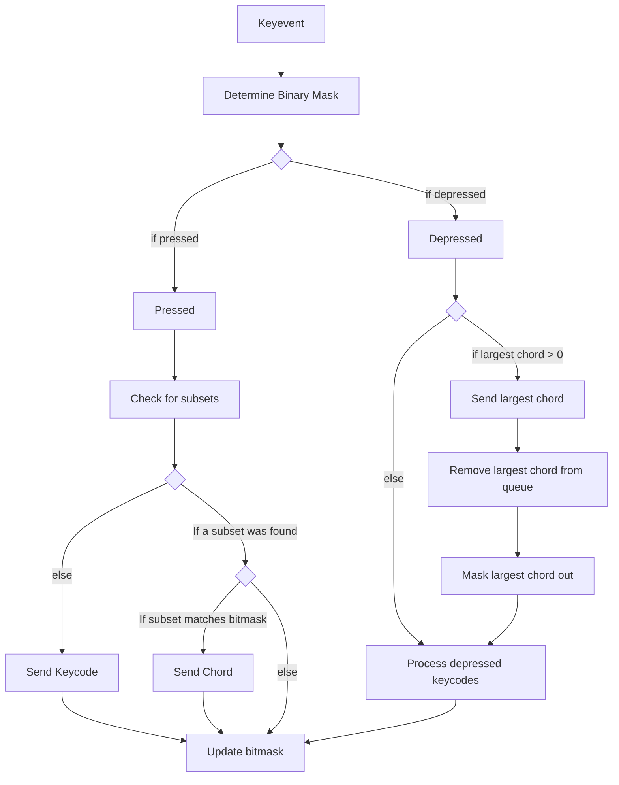

```mermaid
    graph TD;
    ke[Keyevent]-->nc[Determine Binary Mask];
    nc-->f{ }
 
    f-->|if pressed|p;
    p[Pressed]-->f2[Check for subsets]
    f2-->f3{ }
    f3-->|else|f5[Send Keycode]
    f5-->e
    
    f3-->|If a subset was found|f4{ }
    f4-->|If subset matches bitmask|f6[Send Chord]
    f6-->e
    f4-->|else|e

    f-->|if depressed|d
    d[Depressed]-->f1{ }
    f1-->|if largest chord > 0|n[Send largest chord]
    n-->n2[Remove largest chord from queue]
    n2-->n3[Mask largest chord out]
    f1-->|else|p1
    n3-->p1[Process depressed keycodes]
    p1-->e[Update bitmask]
```
